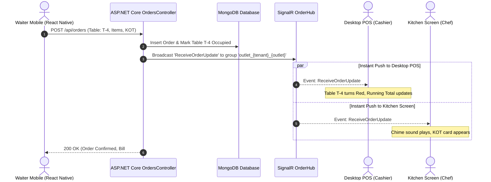

# 🏗️ Architecture, Real-Time Synchronization & Desktop Integration

> **Document Version:** 1.0.0  
> **Key Focus:** Real-time WebSockets with SignalR, Multi-Tenant Data Isolation, React Native Waiter Sync, Desktop App Shell & Thermal ESC/POS Printing.

---

## 1. System Architecture Overview

QuantroBill is architected with a **Clean Onion Architecture** in .NET 8 on the backend and modern reactive client applications on the frontend.

```
┌────────────────────────────────────────────────────────────────────────┐
│                          PRESENTATION LAYER                            │
│  ┌─────────────────────────┐  ┌──────────────────────────────────────┐ │
│  │   Desktop POS / Web     │  │   React Native Waiter / Captain App  │ │
│  │   (React 19 + Tauri)    │  │   (Android Handhelds & Tablets)      │ │
│  └────────────┬────────────┘  └──────────────────┬───────────────────┘ │
│               │                                  │                     │
│               │     ┌──────────────────────┐     │                     │
│               └────►│   Kitchen KDS Screen │◄────┘                     │
│                     │   (Paperless KOT)    │                           │
│                     └──────────┬───────────┘                           │
└────────────────────────────────┼───────────────────────────────────────┘
                                 │ HTTP REST (JSON) + WebSockets (SignalR)
                                 ▼
┌────────────────────────────────────────────────────────────────────────┐
│                     APPLICATION GATEWAY & HOST                         │
│                    [PetBharke.API (.NET 8.0)]                          │
│                                                                        │
│   ┌────────────────────────┐  ┌────────────────────────────────────┐   │
│   │ Middlewares:           │  │ SignalR Hubs:                      │   │
│   │ • GlobalException      │  │ • OrderHub (`/hubs/order`)         │   │
│   │ • JwtAuthentication    │  │   - Group: `outlet_{tenant}_{out}` │   │
│   │ • MultiTenantIsolation │  │   - Group: `kds_{tenant}_{out}`    │   │
│   └────────────────────────┘  └────────────────────────────────────┘   │
└────────────────────────────────┬───────────────────────────────────────┘
                                 │
                                 ▼
┌────────────────────────────────────────────────────────────────────────┐
│                        CORE DOMAIN & SERVICES                          │
│                                                                        │
│   ┌─────────────────────────────────┐ ┌────────────────────────────┐   │
│   │ PetBharke.Application           │ │ PetBharke.Domain           │   │
│   │ • BillingEngine / Calculations  │ │ • Aggregates & Entities    │   │
│   │ • OrderOrchestrator             │ │ • Enums & Value Objects    │   │
│   │ • FluentValidation Rules        │ │ • Domain Events            │   │
│   └─────────────────────────────────┘ └────────────────────────────┘   │
└────────────────────────────────┬───────────────────────────────────────┘
                                 │
                                 ▼
┌────────────────────────────────────────────────────────────────────────┐
│                       INFRASTRUCTURE LAYER                             │
│                    [PetBharke.Infrastructure]                          │
│                                                                        │
│   ┌─────────────────────────────────┐ ┌────────────────────────────┐   │
│   │ MongoDbContext & Repositories   │ │ Security & Auth:           │   │
│   │ • Multi-tenant Collection Index │ │ • JWT Token Generator      │   │
│   │ • Transactional Atomic Updates  │ │ • BCrypt Password Hasher   │   │
│   └─────────────────────────────────┘ └────────────────────────────┘   │
└────────────────────────────────┬───────────────────────────────────────┘
                                 │
                                 ▼
┌────────────────────────────────────────────────────────────────────────┐
│                       DATABASE & CLOUD STORAGE                         │
│                       MongoDB (Local / Atlas)                          │
└────────────────────────────────────────────────────────────────────────┘
```

---

## 2. Multi-Tenant Data Isolation Strategy

Every single entity and collection in MongoDB strictly enforces tenant isolation:

1. **Request Headers & Context:**
   - Every client request passes:
     - `Authorization: Bearer <JWT>`
     - `X-Tenant-Id: <restaurant_id>`
     - `X-Outlet-Id: <outlet_id>`
2. **CurrentUserService Extraction:**
   - Injected into every controller via `ICurrentUserService`:
     ```csharp
     public string? TenantId => _httpContextAccessor.HttpContext?.User?.FindFirst("tenantId")?.Value 
         ?? _httpContextAccessor.HttpContext?.Request.Headers["X-Tenant-Id"].FirstOrDefault();
     ```
3. **Database Indexing for High Performance:**
   - Compound index on all active collections:
     ```csharp
     Builders<Order>.IndexKeys.Ascending(o => o.TenantId).Ascending(o => o.OutletId).Descending(o => o.PlacedAt)
     ```
   - This ensures queries never cross restaurant boundaries and execute in sub-millisecond speeds.

---

## 3. Real-Time Synchronization Engine (SignalR WebSockets)

When a waiter on an Android mobile device punches an order at Table 4:
1. **Desktop POS Screen** must immediately change Table 4's color to **Red (Occupied)** and update the running total.
2. **Kitchen KDS Screen** must play an audio chime, print a KOT, and display the new order card.
3. **Other Waiters' phones** must see that Table 4 is now occupied to avoid duplicate orders.

### 3.1 SignalR Outlet Group Architecture

Connections are grouped by restaurant outlet:
```csharp
// PetBharke.API/Hubs/OrderHub.cs
public class OrderHub : Hub
{
    public async Task JoinOutletGroup(string tenantId, string outletId)
    {
        var groupName = $"outlet_{tenantId}_{outletId}";
        await Groups.AddToGroupAsync(Context.ConnectionId, groupName);
    }
}
```

### 3.2 Live Event Broadcast Pipeline



### 3.3 Event Contract

| Event Name | Triggered When | Payload | Handled By |
| :--- | :--- | :--- | :--- |
| `ReceiveOrderUpdate` | New order created / items added / KOT fired | Full `Order` object | POS, Tables, KDS, Mobile |
| `OrderStatusChanged` | Chef marks order "Ready" or Cashier settles | `{ orderId, status }` | POS, Mobile Waiter alert |
| `TableStatusChanged` | Table occupied, vacated, shifted, or merged | `{ tableNumber, isOccupied, total }` | Floor Plan, Waiter App |
| `ItemAvailabilityChanged` | Item marked "86" (Out of stock) | `{ menuItemId, isAvailable }` | All devices instantly |

---

## 4. Desktop Application Strategy (Tauri / Electron)

While the system is accessible via any web browser, a restaurant billing counter requires a **Desktop Application** for:
- Silent direct thermal printing (no print preview popup).
- Offline billing continuity when internet drops.
- Hardware integration (Cash drawer kick, barcode scanner, weighing scale via USB/COM port).

### 4.1 Recommended Desktop Tech: **Tauri 2.0 with React** (or Electron)
* **Why Tauri?**
  - Ultra-lightweight installer (< 15 MB compared to Electron's 150 MB).
  - Native OS performance with Rust backend.
  - Direct access to local USB, Serial Port (RS232), and Raw TCP/IP sockets for thermal printing.

### 4.2 Offline-First Architecture & Sync Queue

```
[Cashier Actions]
       │
       ▼
[Offline Detection: navigator.onLine]
       │
   ┌───┴───────────────────────────────┐
   │ ONLINE                            │ OFFLINE
   ▼                                   ▼
[Call REST API directly]        [Save to IndexedDB SyncQueue]
   │                                   │
   │                                   ▼
   │                            [Generate Local Temp Bill #OFF-101]
   │                                   │
   │                                   ▼
   │                            [Print Receipt Locally]
   │                                   │
   │                                   ▼
   │                            [Listen for 'online' event]
   │                                   │
   └───────────────┬───────────────────┘
                   ▼
         [Replay SyncQueue in batches to API]
```

---

## 5. Thermal ESC/POS Printing Engine

### 5.1 Architecture of the Printing Subsystem
Thermal printers (Epson, TVS, Star Micronics, Posiflex, NGX) understand the **ESC/POS** command language:
- `0x1B 0x40` (Initialize printer)
- `0x1B 0x61 0x01` (Center align)
- `0x1D 0x21 0x11` (Double width & double height for bill title)
- `0x1D 0x56 0x41` (Cut paper full cut)
- `0x1B 0x70 0x00 0x19 0xFA` (Kick open cash drawer via RJ11 port)

### 5.2 Supported Print Topologies

```
┌─────────────────────────────────────────────────────────────┐
│                 PRINT DISPATCHER SERVICE                    │
└──────────────────────────────┬──────────────────────────────┘
                               │
       ┌───────────────────────┼───────────────────────┐
       ▼                       ▼                       ▼
┌──────────────┐        ┌──────────────┐        ┌──────────────┐
│  LAN Network │        │ USB / Serial │        │  Bluetooth   │
│  (Ethernet)  │        │ (COM Port)   │        │  (SPP / BLE) │
└──────┬───────┘        └──────┬───────┘        └──────┬───────┘
       │ TCP:9100              │ WebSerial             │ Mobile App
       ▼                       ▼                       ▼
┌──────────────┐        ┌──────────────┐        ┌──────────────┐
│ Kitchen KOT  │        │ Billing Desk │        │ Handheld     │
│ Printer      │        │ Thermal Rec. │        │ Waiter POS   │
└──────────────┘        └──────────────┘        └──────────────┘
```

1. **Network (LAN) Printing (Kitchen):**
   - Each kitchen section has a printer with a static IP (e.g., `192.168.1.201:9100`).
   - Server or Desktop client opens a raw TCP socket to port 9100 and sends the ESC/POS byte array directly.
2. **USB Thermal Printer (Billing Counter):**
   - Desktop app uses raw printer drivers (Win32 Spooler API) to send ESC/POS byte streams silently without showing browser dialogs.
3. **Bluetooth Printer (Waiter Mobile App):**
   - Waiter smartphone pairs with a 58mm portable thermal printer (`react-native-thermal-receipt-printer`).
